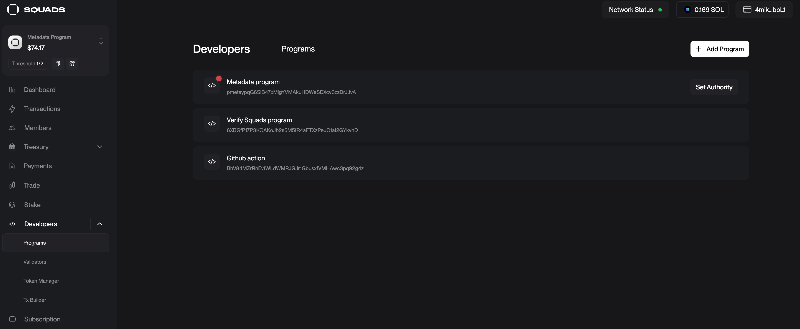
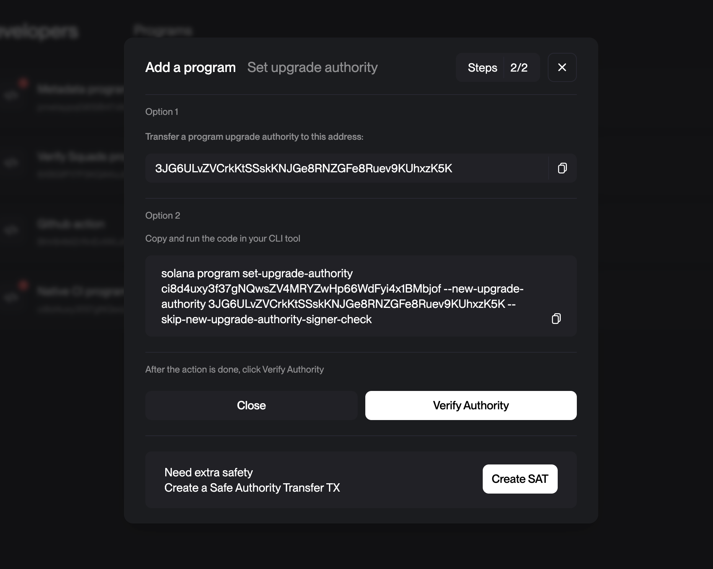

# How setup github action CI for native solana program

## Step 1: Create a new repository

Create a new repository on github and clone it locally.

## Step 2: Create Solana Program

Follow this [install guide](https://solana.com/de/developers/guides/getstarted/local-rust-hello-world)
Just make sure you have the program in the root of the repo like here in this repository.

Don't forget to add a `gitignore` file to the root of the repo to ignore the `target` directory.

```bash file=.gitignore
.secrets
.env
.anchor
.DS_Store
target
**/*.rs.bk
node_modules
test-ledger
.yarn
```

## Step 3: Create Github Actions Workflow

Create a new file in the `.github/workflows` directory called `build.yaml`.

```yaml
name: Devnet Build and Deploy with IDL

on:
  workflow_dispatch:
    inputs:
      priority_fee:
        description: "Priority fee for transactions"
        required: true
        default: "300000"
        type: string

jobs:
  build:
    uses: Woody4618/github-action/.github/workflows/reusable-build.yaml@main
    with:
      program: "transaction_example"
      network: "devnet"
      deploy: true
      upload_idl: true
      verify: false
      use-squads: false
      priority-fee: ${{ github.event.inputs.priority_fee }}
    secrets:
      DEVNET_SOLANA_DEPLOY_URL: ${{ secrets.DEVNET_SOLANA_DEPLOY_URL }}
      DEVNET_DEPLOYER_KEYPAIR: ${{ secrets.DEVNET_DEPLOYER_KEYPAIR }}
      PROGRAM_ADDRESS_KEYPAIR: ${{ secrets.PROGRAM_ADDRESS_KEYPAIR }}
```

Replace your program name in the `program` field.

Set the environment variables in the repository settings.

You can even create your own keypair and let the workflow deploy it for you fpr PROGRAM_ADDRESS_KEYPAIR.

```bash
solana-keygen grind --starts-with ci:1
```

## Step 4: Test the workflow

Run the workflow manually in the actions tab in your repository to make sure it works.

## Step 5: Mainnet

The mainnet flow is very similar to the devnet flow.

You just need to create a new workflow file in the `.github/workflows` directory called `mainnet.yaml`.

```yaml
name: Mainnet Build Deploy and verify

on:
  workflow_dispatch:
    inputs:
      priority_fee:
        description: "Priority fee for transactions"
        required: true
        default: "300000"
        type: string

jobs:
  build:
    uses: Woody4618/solana-github-action-workflow/.github/workflows/reusable-build.yaml@main
    with:
      program: "hello_world"
      network: "mainnet"
      deploy: true
      upload_idl: false
      verify: true
      use-squads: false
      priority-fee: ${{ github.event.inputs.priority_fee }}
    secrets:
      MAINNET_SOLANA_DEPLOY_URL: ${{ secrets.MAINNET_SOLANA_DEPLOY_URL }}
      MAINNET_DEPLOYER_KEYPAIR: ${{ secrets.DEVNET_DEPLOYER_KEYPAIR }}
      PROGRAM_ADDRESS_KEYPAIR: ${{ secrets.PROGRAM_ADDRESS_KEYPAIR }}
```

# Step 6: Move your program to squads (Only mainnet)

Add you program to your squad in the [squads V4 ui](https://v4.squads.so/squads/):



Then change the authority of the program to the squad:



Once that is done copy the squads vault address and the squads multisig address and add them to the repository secrets as `MAINNET_MULTISIG` and `MAINNET_MULTISIG_VAULT` respectively.

The `MAINNET_MULTISIG_VAULT` you can see on the top left of the squads ui.
The `MAINNET_MULTISIG` is the address you can find unser settings a little bit hidden so that you don't use it accidentally.

Now you are ready to use the workflow to deploy your program to the mainnet using squads.
Every successful run will add a new transaction to the squads multisig that you can then approve.

Note: The `MAINNET_DEPLOYER_KEYPAIR` you defined in your workflow needs to have at least Voter permission on your squads to be able to propose transactions. So the build will fail to create the transaction if you don't have the right permissions.
